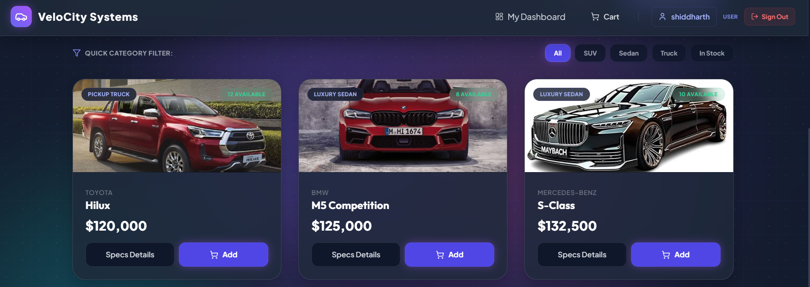
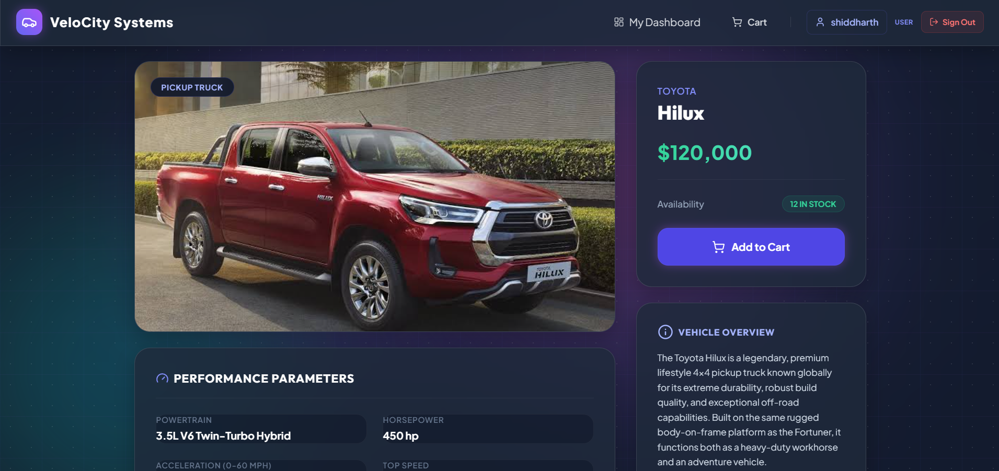

# VeloCity Systems - Car Dealership Inventory System

VeloCity Systems is a modern, high-fidelity luxury and performance car dealership inventory system. Built on a robust MERN-like stack (MongoDB, Express, React, Node.js) with Prisma Client, it supports comprehensive customer and administrator consoles.

---

## 🚗 Project Overview

VeloCity Systems bridges the gap between customer-facing showroom exploration and dealership management.

### Features
* **Interactive Showroom**: Browse luxury sports cars, SUVs, and trucks with real-time stock availability.
* **Premium Specifications View**: Dedicated specifications layout displaying engine powertrain details, horsepower, acceleration metrics, transmission configurations, and fuel range.
* **Database Manual Overrides**: Administrators can manually override performance specifications when adding or editing vehicles.
* **Cart & Checkout**: Multi-item shopping cart checkout with transactional purchase validations.
* **Interactive Receipt Modal & PDF Export**: Instantly view purchase transactions and export detailed, print-ready PDF invoices.
* **Administrator Console**: Real-time business metrics tracking:
  * **Fleet Valuation**: Cumulative inventory asset value.
  * **Gross Sales Revenue**: Cumulative transaction revenue calculated dynamically.
  * **Stock Warnings**: Visual indicators flag low-stock (≤ 2 units) and out-of-stock items.
  * **Management CRUD**: Add new models, update pricing, restock units, and immediately delete catalog records.

---

## 🛠️ Technology Stack

* **Frontend**: React, React Router, Vite, Tailwind CSS, Lucide React icons, Axios.
* **Backend**: Node.js, Express, Prisma Client, JWT Authentication, bcryptjs.
* **Database**: MongoDB.
* **Testing**: Jest, Supertest.

---

## 💻 Setup and Installation Instructions

Follow these steps to configure and launch VeloCity Systems locally:

### 1. Prerequisites
Ensure you have **Node.js** (v18+) and **MongoDB** installed and running on your system.

### 2. Backend Setup
1. Open a terminal and navigate to the `backend` folder:
   ```bash
   cd backend
   ```
2. Install the server-side dependencies:
   ```bash
   npm install
   ```
3. Create a `.env` file in the `backend` directory (if not already present) with your MongoDB connection string and server port details:
   ```env
   PORT=5000
   MONGODB_URI="mongodb://127.0.0.1:27017/car_dealership"
   JWT_SECRET="supersecretkey123"
   NODE_ENV="development"
   ```
4. Push your Prisma database schema to MongoDB:
   ```bash
   npx prisma db push
   ```
5. Seed initial vehicle inventory records:
   ```bash
   npm run seed
   ```
6. Start the backend development server:
   ```bash
   npm run dev
   ```
   *The server runs at [http://localhost:5000](http://localhost:5000).*

### 3. Frontend Setup
1. In a new terminal tab, navigate to the `my-react-app` directory inside `frotend`:
   ```bash
   cd frotend/my-react-app
   ```
2. Install client-side dependencies:
   ```bash
   npm install
   ```
3. Start the Vite React development server:
   ```bash
   npm run dev
   ```
   *The application will open automatically at [http://localhost:5173/](http://localhost:5173/).*

---

## 📸 Application Screenshots


### 1. Administrator Management Console
*Dynamic reporting showing Fleet Valuations, Gross Sales Revenue, and Stock Warnings.*


### 2. High-Fidelity Showroom Catalog
*Clean card components displaying category tags, starting price configurations, and shopping options.*


### 3. Vehicle Details & Specs Grid
*Custom specs detail list representing powertrain attributes, acceleration, top speed, and warranty info.*


---

## 🧪 Test Suite & Report

The project features a comprehensive integration and controller testing suite in Jest verifying authorization middleware, CRUD endpoints, and inventory operations.

### Run Tests locally
In the `backend` folder, run:
```bash
npm test
```

### Live Test Execution Report
```bash
PASS src/tests/vehicle.test.js
PASS src/tests/auth.test.js

Test Suites: 2 passed, 2 total
Tests:       33 passed, 33 total
Snapshots:   0 total
Time:        4.994 s
Ran all test suites.
```

---

## 🤖 My AI Usage

### 1. Code Generation
* Designed premium responsive SVG car layouts to represent vehicle categories when no image is uploaded.
* Drafted Prisma schemas and mapping updates to integrate powertrain, top speed, horsepower, range, and acceleration overrides.
* Built automatic parsing logic to scrape conversation logs and write out `PROMPTS.md`.

### 2. Debugging & Troubleshooting
* Resolved CORS pre-flight configurations and password credentials verification issues.
* Handled Cart Context reducer initialization errors caused by browser cache pollution.
* Fixed PowerShell script execution policies issues by redirecting build actions via direct `npm.cmd` triggers.

---

## 📝 Prompt History Guide
You can find the entire, untruncated AI tooling interaction history containing all prompts and instructions inside [PROMPTS.md](PROMPTS.md) at the root of the project.
